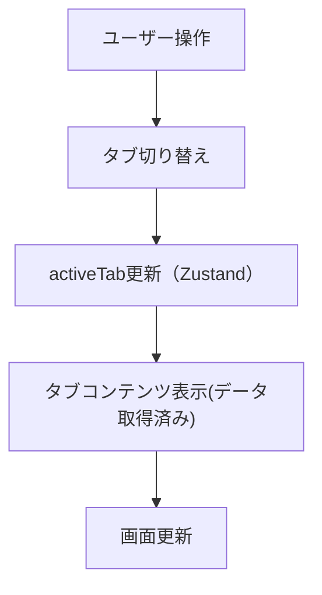

# フロントエンド設計書作成ガイド（Copilot Instruction）

## 基本方針
- 日本語で出力すること
- 作成対象は **フロントエンドの詳細設計書（Markdown形式）**
- ファイルは `docs/frontend/` ディレクトリに格納すること
- コード例・UI仕様・イベントフローなどを含め、**開発者が実装可能なレベル**まで具体的に記載すること
- 図や処理の流れは **Mermaid 記法**で表現すること

---

## documents
- docs/frontend/`[page-name].md` : 各ページごとの詳細設計書

---

## 詳細設計書の構成

各ページの設計書は以下のセクション構成で作成してください。

```md
# [ページ名] 詳細設計書

## 1. ページ概要
- ページの目的・機能概要
- 対象ユーザー・利用シナリオ
- 関連ページへの遷移

## 2. UI構成
- 主なコンポーネント構造
- 使用ライブラリ・UIパーツ
- レイアウトの説明（GridやFlex構成など）

## 3. データフロー


## 4. 状態管理・ロジック
使用ストア（例：Zustand）

主なstate・getter・action の一覧

API通信時のローディング・エラー処理の流れ

## 5. ルーティング
ページのパス構成 (/portfolio/:id など)

ルーティングガード・条件付き遷移がある場合はその内容

## 6. イベント・アクション仕様
イベント	発火条件	処理内容	結果
click	「保存」ボタン押下	フォームバリデーション + API送信	トースト表示 & モーダルクローズ

## 7. APIインターフェース
エンドポイント	メソッド	リクエスト例	レスポンス例
/api/portfolios/:id	GET	{ id: 1 }	{ name: "React Portfolio" }

## 8. エラーハンドリング
バリデーションエラー

API失敗時のメッセージ方針

再試行処理の有無

## 9. その他仕様
SEO設定 / Meta情報

パフォーマンス考慮点（画像最適化、キャッシュなど）
---

## 命名規則・ドキュメント生成ルール
- コンポーネント名、変数名は**役割が明確な英単語**を使用する
- マジックナンバーは避け、`const` として定義する
- JSDoc コメントで引数・戻り値の型を明示する
- コード例を含める場合はTypeScriptで記述する

---

## 出力形式
- ファイル形式: `.md`
- 文字コード: UTF-8
- 1ページ1ファイル
- 可能なら図・コード例・表を組み合わせ、可視性を高める

---

## applyTo: "\*\*"
