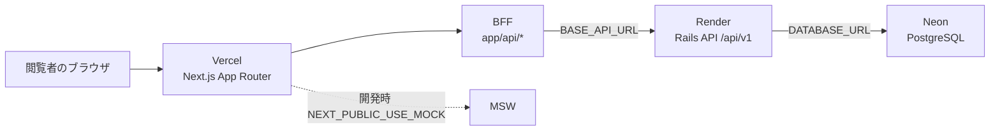

# To You Design Portfolio


制作実績・スキルセットを伝える個人ポートフォリオです。  
公開サイト: [https://to-you-design.vercel.app/](https://to-you-design.vercel.app/)

## 目次

- [システムの特徴](#システムの特徴)
- [アーキテクチャ](#アーキテクチャ)
- [技術スタック](#技術スタック)
- [ディレクトリ構成](#ディレクトリ構成)
- [ブランチについて](#ブランチについて)
- [コマンド](#コマンド)
- [Author](#author)
- [License](#license)

## システムの特徴

コンポーネント設計、テスト容易性、保守性を重視し、実務を想定した構成にしています。

- **Next.js App Router**: ページは Route Group で公開面と管理画面を分割
- **BFF**: ブラウザは Rails API を直接呼ばず、`app/api` の Route Handler が中継する
- **コンポーネント指向**: `components/` と各ルートの `_containers` / `sections` に責務を分ける
- **レスポンシブ対応**: PC / SP 両対応
- **品質担保**: Vitest（Node / Browser）と Playwright による Unit / Integration / E2E
- **計測**: Google Analytics、GTM、Microsoft Clarity、Vercel Speed Insights

## アーキテクチャ

ブラウザは公開ページを Vercel 上の Next.js から受け取ります。データ取得は Next.js の API Route が BFF になり、Render 上の Rails API（`/api/v1`）へ接続します。データベースは Neon の PostgreSQL です。開発時は `NEXT_PUBLIC_USE_MOCK=true` で MSW によるモック起動もできます。



| 層 | サービス | 役割 |
| --- | --- | --- |
| フロント / BFF | Vercel | Next.js の配信と Route Handler |
| バックエンド API | Render | Rails API モード |
| データベース | Neon | PostgreSQL |

環境変数の役割は次のとおりです。`BASE_API_URL` はサーバー専用で、ブラウザへ公開しません。

- `NEXT_PUBLIC_API_URL`: フロントから自前の `/api` を呼ぶ URL
- `BASE_API_URL`: サーバーから Rails API を呼ぶ URL
- `NEXT_PUBLIC_USE_MOCK`: クライアント側モックの有効化

詳細なデプロイ手順は [docs/deploy.md](./docs/deploy.md)、API 仕様は [docs/api.md](./docs/api.md) を参照してください。

## 技術スタック

### ランタイム

- Node.js: v24.1.0
- pnpm: v10.0.0

### フロントエンド

- [Next.js](https://nextjs.org/) 16.2.3（React Compiler / Turbopack）
- [React](https://react.dev/) 19.2.4
- [TypeScript](https://www.typescriptlang.org/) 5.9.x

### バックエンド（別サービス）

このリポジトリはフロントエンドです。コンテンツ API は Rails API を Render で動かしています。

- Ruby on Rails API `/api/v1`
- PostgreSQL（Neon）

### リンター / フォーマッタ

- [OxLint](https://oxc.rs/docs/guide/usage/linter) 1.46.x
- [Oxfmt](https://oxc.rs/docs/guide/usage/formatter)
- [Stylelint](https://stylelint.io/) 16.8.x
- [Husky](https://typicode.github.io/husky/) 9.1.x
- [commitlint](https://commitlint.js.org/) 19.x

### テスト

- [Vitest](https://vitest.dev/) 4.0.x
- [Vitest Browser](https://vitest.dev/guide/browser.html)
- [React Testing Library](https://testing-library.com/docs/react-testing-library/intro/) 16.x
- [Playwright](https://playwright.dev/) 1.57.x
- [MSW](https://mswjs.io/) 2.11.x
- [Storybook](https://storybook.js.org/) 10.3.x

### ホスティング

- [Vercel](https://vercel.com/)（フロント / BFF）
- [Render](https://render.com/)（Rails API）
- [Docker](https://www.docker.com/)（ローカル開発。`docker compose up --build`）

### 状態管理 / 通信

- [SWR](https://swr.vercel.app/ja) 2.3.x
- [Zustand](https://zustand.docs.pmnd.rs/) 5.0.x

### フォーム / バリデーション

- [React Hook Form](https://react-hook-form.com/) 7.53.x
- [Zod](https://zod.dev/) 4.1.x

### 分析・監視

- [Google Analytics](https://developers.google.com/analytics?hl=ja) / [GTM](https://tagmanager.google.com/)
- [Microsoft Clarity](https://clarity.microsoft.com/)
- [Vercel Speed Insights](https://vercel.com/docs/speed-insights)
- [pino](https://github.com/pinojs/pino) 10.1.x
- [New Relic](https://newrelic.com/)

### UI / 表現

- [Swiper](https://swiperjs.com/react) 12.1.x
- [React Three Fiber](https://docs.pmnd.rs/react-three-fiber/) 9.0.0-alpha.8
- [React Modal](https://reactcommunity.org/react-modal/) 3.16.x
- [EmailJS](https://www.emailjs.com/) 4.4.x

## ディレクトリ構成

```text
.
├── app/                 # App Router（ページ・API Route）
│   ├── (home)/          # トップページ
│   ├── (auth)/admin/    # 管理画面
│   ├── about/           # 自己紹介
│   ├── portfolios/      # 制作実績一覧・詳細
│   ├── blog/            # Zenn 記事一覧
│   ├── contact/         # お問い合わせ
│   ├── api/             # BFF（Rails API への中継）
│   └── layout.tsx
├── components/          # 共通 UI / レイアウト
├── hooks/               # データ取得・カスタムフック
├── stores/              # Zustand
├── mocks/               # MSW
├── styles/              # グローバル SCSS
├── utils/               # パス・メタデータなど
├── types/               # 型定義
├── __tests__/           # unit / browser / integration / e2e / api
├── stories/             # Storybook
├── docs/                # 設計・デプロイ・画面仕様
├── public/              # 静的ファイル
├── docker-compose.yml
└── package.json
```

## ブランチについて

`develop` が開発、`main` が本番です。

| ブランチ名 | 役割 | 派生元 | マージ先 |
| --- | --- | --- | --- |
| main | 公開ブランチ | — | — |
| develop | 開発ブランチ | main | main |
| feature* | 機能開発 | develop | develop |

## コマンド

```bash
# 依存関係のインストール
pnpm install

# ブラウザテスト / E2E 用ブラウザの導入
pnpm playwright:install

# 開発環境起動（http://localhost:3001）
pnpm dev

# モック環境で起動
pnpm dev:mock

# Docker で開発環境起動
docker compose up --build

# ビルド
pnpm build

# 本番相当の起動
pnpm start

# Lint / Format / 型チェック
pnpm lint
pnpm format
pnpm typecheck

# テスト
pnpm test --project node
pnpm test --project browser
pnpm playwright

# Storybook
pnpm storybook

# Lighthouse（unlighthouse）
pnpm unlighthouse
```

# Author

* 作成者 阿部 舜平
* E-mail harrier2070@gmail.com

# License

3Dモデルは以下を使用しています。  
https://sketchfab.com/3d-models/red-triangular-cage-sphere-96e0750262fb450fa2c8bc5a1e879fcc
