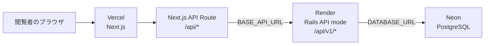

# デプロイガイド

このドキュメントでは、ポートフォリオサイトを以下の無料構成でデプロイ・運用する手順をまとめる。

| 層 | サービス | 役割 |
| --- | --- | --- |
| フロントエンド / BFF | Vercel | Next.js を `pnpm` でビルド・配信し、Route Handler からバックエンド API を呼び出す |
| バックエンド API | Render | Rails API モードを Web Service として起動する |
| データベース | Neon | PostgreSQL を提供する |

> [!NOTE]
> この構成は個人ポートフォリオ、デモ、小規模な閲覧用途を対象にした無料構成である。商用サービス、常時低遅延が求められるサービス、重要データを扱う本番環境には無料枠のまま使用しない。

## 構成



ブラウザは Rails API を直接呼び出さない。Next.js の `app/api/**/route.tsx` が BFF（Backend for Frontend）として Render の `/api/v1/*` を呼び出し、そのレスポンスを返す。

- フロントエンドから API Route を呼ぶ URL: `NEXT_PUBLIC_API_URL`
- Vercel のサーバーから Rails API を呼ぶ URL: `BASE_API_URL`
- Rails から Neon PostgreSQL へ接続する URL: `DATABASE_URL`

`BASE_API_URL` と `DATABASE_URL` はブラウザへ公開しない。`NEXT_PUBLIC_` を付ける環境変数だけがクライアントバンドルに含まれる。

## リポジトリ構成

フロントエンドのリポジトリでは、Rails API を `docs/backend` の Git submodule として参照している。

```text
nextjs-portfolio/                 # フロントエンド（Vercel）
├── app/api/                      # Next.js API Route。Rails API への中継
├── hooks/fetcher.ts              # フロントエンド用 API 呼び出し
├── docs/backend/                 # Rails API の submodule（Render）
└── package.json                  # pnpm の scripts
```

初回 clone 時は submodule を含めて取得する。

```bash
git clone --recurse-submodules <frontend-repository-url>
```

すでに clone 済みの場合は次を実行する。

```bash
git submodule update --init --recursive
```

バックエンドを変更する場合は、`docs/backend` に移動してバックエンドリポジトリへ commit / push する。submodule の参照先をフロントエンド側にも反映したい場合は、親リポジトリで `git add docs/backend` を実行して commit する。

## 1. Neon: PostgreSQL を作成する

1. Neon で PostgreSQL プロジェクトを作成する。
2. **Connect** 画面から接続文字列を取得する。
3. 接続文字列を Render の `DATABASE_URL` に設定する。

Rails 側の [`docs/backend/config/database.yml`](backend/config/database.yml) は `DATABASE_URL` を参照し、production では SSL 接続（`sslmode: require`）を使用する。

```text
DATABASE_URL=postgresql://<user>:<password>@<neon-host>/<database>?sslmode=require
```

接続文字列は機密情報である。リポジトリ、`render.yaml`、クライアント公開用の環境変数に含めない。

### Neon 無料枠でできること

Neon Free は、個人開発・小規模なポートフォリオのデータ保存には利用できる。

- 1プロジェクトあたりストレージ 0.5 GB
- 1プロジェクトあたり月間 100 CU-hours のコンピュート
- 非アクティブ時は 5 分後に scale-to-zero
- 100 プロジェクト、各プロジェクト 10 ブランチまで
- 無料枠を超えるデータ量・常時アクセス・高い同時接続数には有料プランを検討する

プラン内容は変更されるため、運用時は [Neon Pricing](https://neon.com/pricing) で最新の使用量を確認する。

## 2. Render: Rails API をデプロイする

Rails API の実体は `docs/backend` submodule のリポジトリで管理している。Render には親のフロントエンドリポジトリではなく、このバックエンドリポジトリを接続する。

1. Render Dashboard で **New > Web Service** を選ぶ。
2. バックエンドリポジトリ `next-portfolio-backend-posgre` を接続する。
3. Runtime は Docker を選択する。
4. Instance Type は **Free** を選択する。
5. 以下の環境変数を Render に設定する。
6. デプロイ後に `https://<render-service>.onrender.com/` が `OK` を返すことを確認する。

この API は **Docker コンテナ**として Render にデプロイする。`docs/backend/docker/Dockerfile` で Ruby 3.2.6、PostgreSQL クライアント、Gem 依存関係を含むイメージをビルドし、コンテナの `CMD` で `rails server -b 0.0.0.0` を起動する。Puma は Render が渡す `PORT` を listen する。`docs/backend/render.yaml` も Free Web Service の設定例として利用できる。

### Docker コンテナの設定

バックエンドリポジトリの Dockerfile はリポジトリ直下ではなく `docker/Dockerfile` にある。そのため Render Dashboard では次を確認する。

| Render の設定 | 値 |
| --- | --- |
| Language / Runtime | `Docker` |
| Dockerfile Path | `docker/Dockerfile` |
| Docker Build Context | バックエンドリポジトリのルート（`.`） |
| Docker Command | 空欄（Dockerfile の `CMD` を使用） |

Dockerfile は `COPY Gemfile` と `COPY .` を使うため、Build Context はバックエンドリポジトリのルートにする。Render は Dockerfile の `CMD` を既定で実行するため、通常は Docker Command を上書きしない。Dockerfile がリポジトリ直下にない場合は Dockerfile Path の明示が必要である。詳細は [Render の Docker デプロイ手順](https://render.com/docs/docker) を参照する。

ローカルでは次のコマンドでコンテナを起動できる。

```bash
cd docs/backend
docker compose up --build
```

起動後は `http://localhost:3000/` が `OK` を返すことを確認する。

> [!WARNING]
> 現在の Dockerfile の起動コマンドは Rails サーバーのみであり、`db:migrate` は自動実行しない。migration を追加したデプロイでは、アプリ起動前に `bundle exec rails db:migrate` を実行する手順を別途用意する。Free Web Service は Shell / one-off job を使えないため、CI などで自動化するか、有料化して実行方法を確保する。

### Render の環境変数

| 変数 | 必須 | 設定値 |
| --- | --- | --- |
| `DATABASE_URL` | 必須 | Neon で発行した PostgreSQL 接続文字列 |
| `RAILS_ENV` | 必須 | `production` |
| `RAILS_MASTER_KEY` | 必須 | バックエンドの Rails credentials を復号する値 |
| `RAILS_LOG_TO_STDOUT` | 推奨 | `true` |

`RAILS_MASTER_KEY` と `DATABASE_URL` は Dashboard の Secret として登録し、Git に commit しない。

### CORS の更新

Rails は [`docs/backend/config/initializers/cors.rb`](backend/config/initializers/cors.rb) で許可オリジンを管理している。Vercel の独自ドメイン、Preview URL、またはローカル開発用 URL を追加した場合はこの設定も更新して Render へデプロイする。

現行のフロントエンドは Next.js API Route を主に経由するため、CORS に依存しない設計になっている。それでも将来ブラウザから Rails API を直接呼ぶ場合は、必要なオリジンだけを明示的に許可する。

### Render 無料枠でできること・注意点

- Rails、Node.js、Python 等の Web Service を Free でホストできる。
- 15 分間リクエストがないとサービスが停止し、次のアクセス時の起動には約 1 分かかる。
- ワークスペース全体で月 750 Free instance hours。上限に達すると月末まで Free Web Service が停止する。
- ファイルシステムはエフェメラルであり、再起動・再デプロイ・停止でローカルに保存したファイルは失われる。
- Free Web Service は単一インスタンスのみで、永続ディスク、SSH、edge caching、one-off job を利用できない。
- 常時応答、管理画面の即時性、バッチ処理、画像アップロードの永続化が必要になったら有料インスタンスまたは外部ストレージへ移行する。

無料枠の仕様と使用量は [Render Free instances](https://render.com/docs/free) で確認する。

## 3. Vercel: Next.js フロントエンドをデプロイする

1. Vercel Dashboard で **Add New > Project** を選ぶ。
2. フロントエンドリポジトリ `nextjs-portfolio` を import する。
3. Framework Preset は **Next.js** を選ぶ。
4. Package Manager は **pnpm** を選ぶ。`package.json` の `packageManager` は `pnpm@10.0.0` を指定している。
5. Build Command は通常 `pnpm build`、Install Command は `pnpm install` を使用する。
6. 下表の環境変数を Production（必要に応じて Preview / Development）に設定する。
7. `main` ブランチへの push で Production deployment が作成されることを確認する。

### Vercel の環境変数

| 変数 | 公開範囲 | 例・用途 |
| --- | --- | --- |
| `NEXT_PUBLIC_API_URL` | ブラウザへ公開 | `https://<vercel-domain>/`。末尾の `/` を含める。フロントエンドが Next.js API Route を呼ぶための URL |
| `BASE_API_URL` | サーバーのみ | `https://<render-service>.onrender.com/`。末尾の `/` を含める。API Route / Server Action が Rails API を呼ぶための URL |
| `NEXT_PUBLIC_NODE_ENV` | ブラウザへ公開 | `production`。本プロジェクトでは GA、GTM、Clarity、Speed Insights の読み込み条件に利用する |
| `NEXT_PUBLIC_GTM` | ブラウザへ公開 | Google Tag Manager のコンテナ ID（`GTM-` を除く値） |
| `NEXT_PUBLIC_GATAG` | ブラウザへ公開 | GA4 の測定 ID（必要な場合） |
| EmailJS 関連の `NEXT_PUBLIC_*` | ブラウザへ公開 | お問い合わせフォームで使用する値 |

> [!IMPORTANT]
> Vercel が設定する `NODE_ENV=production` と、アプリが参照する `NEXT_PUBLIC_NODE_ENV` は別の変数である。後者が未設定だと、解析タグの条件が満たされず GA / GTM / Clarity / Speed Insights が読み込まれない。

### API Route の確認

Vercel へのデプロイ後、Next.js の API Route と Rails API の両方を確認する。

```bash
# Vercel の BFF（Next.js API Route）
curl -i https://<vercel-domain>/api/portfolios

# Render の Rails API
curl -i https://<render-service>.onrender.com/api/v1/portfolios
```

両方とも `200` と API の JSON が返れば、Vercel → Render → Neon の経路は接続できている。

### Vercel Hobby 無料枠でできること・注意点

Vercel Hobby は個人開発・非商用利用向けである。本ポートフォリオのような個人サイトには適するが、業務・商用利用には Pro 以上を検討する。

主な無料枠の目安は以下のとおり。

- Next.js の自動デプロイ、Preview Deployment、HTTPS、独自ドメインに対応
- 月間 100 GB の Fast Data Transfer
- 月間 4 CPU-hours、Vercel Functions の 100 万 invocation、100 GB-hours の Function Duration
- 画像最適化は月 1,000 source images、Speed Insights は 10,000 data points
- 1日 100 deployment、1 deployment あたりビルド時間は最大 45 分
- 上限超過時は、原則として該当機能の利用を待機する必要がある

最新の上限は [Vercel Hobby Plan](https://vercel.com/docs/plans/hobby) と [Vercel Limits](https://vercel.com/docs/limits) を確認する。

## デプロイ順序

環境変数の依存関係があるため、以下の順で作業する。

1. Neon で DB を作成して `DATABASE_URL` を取得する。
2. Render に `DATABASE_URL`、`RAILS_ENV`、`RAILS_MASTER_KEY` を設定し、Rails API をデプロイする。
3. Render の公開 URL を確認し、Vercel の `BASE_API_URL` に設定する。
4. Vercel に `NEXT_PUBLIC_API_URL` と必要な公開環境変数を設定し、フロントエンドをデプロイする。
5. Vercel の `/api/*`、Render の `/api/v1/*`、画面表示を順に確認する。

## デプロイ後チェックリスト

- [ ] Vercel の Build Log が成功している。
- [ ] `pnpm build` がローカルでも成功する。
- [ ] `BASE_API_URL` は Render の公開 URL を指し、末尾に `/` がある。
- [ ] Render の `DATABASE_URL` は Neon の接続文字列である。
- [ ] Render の Root URL が `200 OK` を返す。
- [ ] `/api/portfolios` など Vercel API Route が `200` を返す。
- [ ] Rails API の `/api/v1/portfolios` が `200` を返す。
- [ ] 15 分以上の未アクセス後、Render API の初回応答が遅くなる無料枠の挙動を許容できる。
- [ ] Neon / Render / Vercel の使用量アラートと Dashboard を定期的に確認する。
- [ ] `DATABASE_URL`、`RAILS_MASTER_KEY`、トークン類が Git に含まれていない。

## 無料構成の限界と有料化の目安

この構成は、静的コンテンツが中心でアクセス数が少ない個人ポートフォリオなら無料で継続運用しやすい。一方、次のいずれかが必要になった段階で有料化または構成変更を検討する。

| 状況 | ボトルネック | 対応 |
| --- | --- | --- |
| 初回 API 応答が遅く、UX を損ねる | Render Free のスリープ | Render の有料 Web Service へ変更 |
| 毎月のアクセス・API 呼び出しが増える | Vercel / Render / Neon の使用量上限 | 各 Dashboard の使用量を確認して該当サービスを有料化 |
| DB が 0.5 GB を超える、DB を常時利用する | Neon Free のストレージ / CU-hours | Neon Launch 以上へ変更 |
| ファイルアップロードを保存したい | Render のエフェメラルファイルシステム | Vercel Blob、S3 互換ストレージ等を利用 |
| 商用利用、SLA、チーム権限、監査が必要 | Hobby / Free の用途・機能制約 | Vercel Pro、Render 有料、Neon 有料プランを検討 |

無料枠はサービス側で変更される。課金判断の前には必ず各サービスの公式 Pricing と Dashboard の実使用量を確認する。
