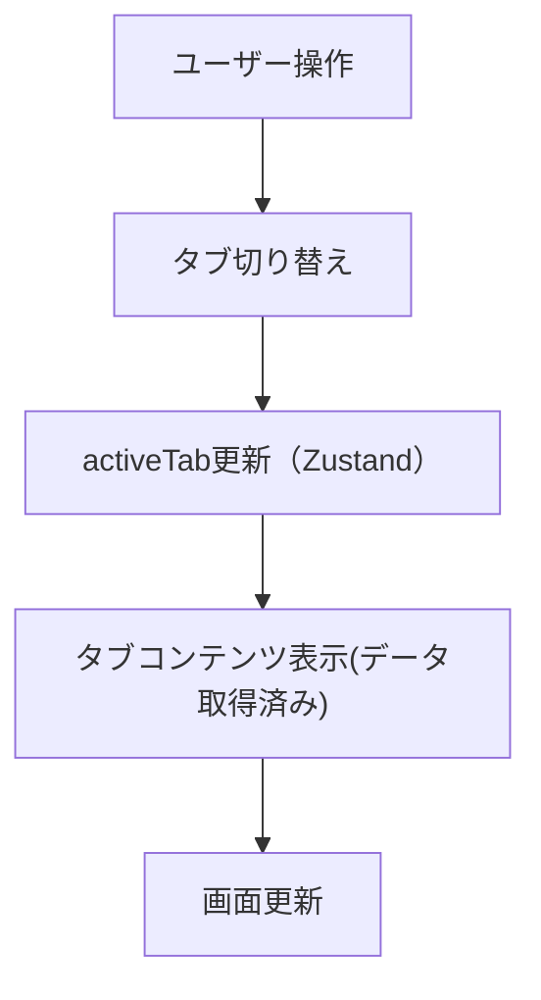

# Aboutページ 詳細設計書

## 1. ページ概要
- プロフィール・経歴・職歴・資格情報を表示するページ
- 対象ユーザー：サイト訪問者・採用担当者
- 利用シナリオ：自己紹介・経歴確認・資格一覧の閲覧
- 関連ページ：トップ（/）、ポートフォリオ（/portfolios）

## 2. UI構成
- パンくずリスト（Breadcrumb）
- タイトル（LowerTitle）
- タブ切り替え（AboutTabs）
  - 経歴（CareerHistoryTimeline）
  - 職歴（JobTimeline）
- 資格セクション（LicenseList）
- レイアウト：max_width, u-padding, section分割

## 3. データフロー

## 4. 状態管理・ロジック
- Zustandストア：activeTab, changeActiveTab
- state一覧：activeTab（"history" or "career"）
- action：changeActiveTab(tab: string)
- Suspenseでローディング表示
- エラー時はfallbackで"読み込み中..."表示

## 5. ルーティング
- パス：/about
- パンくずリストで現在位置表示
- 他ページへの遷移：PATH.ABOUT, PATH.PORTFOLIO

## 6. イベント・アクション仕様
| イベント | 発火条件 | 処理内容 | 結果 |
|----------|----------|----------|------|
| click    | タブラベル押下 | changeActiveTabでstate更新 | タブ内容切り替え |
| Suspense | API/データ取得中 | fallback表示 | "読み込み中..."表示 |

## 7. APIインターフェース
| エンドポイント | メソッド | リクエスト例 | レスポンス例 |
|----------------|---------|--------------|--------------|
| /api/histories | GET     | -            | { data: [...] } |
| /api/jobs      | GET     | -            | { data: [...] } |
| /api/licenses  | GET     | -            | { data: [...] } |

## 8. エラーハンドリング
- バリデーションエラー：なし（表示のみ）
- API失敗時：fallbackで"読み込み中..."表示
- 再試行処理：なし

## 9. その他仕様
- SEO：title, description, meta情報
- パフォーマンス：Suspense活用、画像最適化
- アクセシビリティ：role="tablist"/"tab"/"tabpanel"、ラベル明示

---
