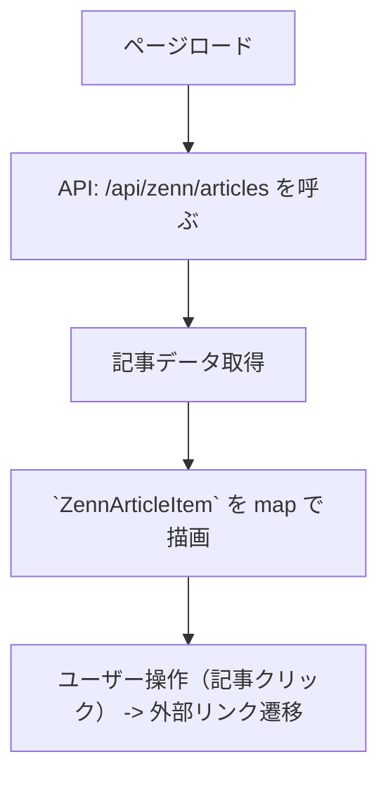

# Blogページ 詳細設計書

## 1. ページ概要
- ページ: `/blog`
- 目的: 外部（Zenn）から取得した記事一覧を表示し、記事詳細や外部リンクへ遷移させる
- 対象ユーザー: サイト訪問者、読者
- 関連ページ: トップ、個別ポートフォリオ

## 2. UI構成
- メイン一覧（`ZennArticleItem` コンポーネントのリスト）
- サイドバー（`ZennAsideArticleItem` コンポーネント）
- ページレイアウト: `.max_width`内で2カラム（メイン+サイド）

## 3. データフロー


## 4. 状態管理・ロジック
- ページ内部state: articles: ZennArticle[]
- 非同期取得: fetch または hooks/fetch-client を利用
- ローディング: 取得中はプレースホルダー表示
- エラー: エラーメッセージと再試行ボタンを表示

## 5. ルーティング
- パス: `/blog`
- 記事クリック: 外部リンク（Zenn記事）へ遷移（target=_blank）

## 6. イベント・アクション仕様
| イベント | 発火条件 | 処理 | 結果 |
| --- | --- | --- | --- |
| click | 記事カード押下 | 外部リンクへ遷移 | 新しいタブで記事を開く |
| fetch | ページロード | API呼び出し | 記事リスト表示/エラー処理 |

## 7. APIインターフェース（内部プロキシ）
- GET /api/zenn/articles
  - 説明: Zenn API から記事一覧を取得し、サイトで使いやすい形式で返す
  - レスポンス例:
  ```json
  {"data": [{"id":"1","title":"...","url":"https://zenn.dev/..."} ]}
  ```

## 8. エラーハンドリング
- ネットワークエラー: 「記事を取得できませんでした。再試行してください」表示
- 空データ: 「記事はまだありません」表示

## 9. コンポーネント一覧
- `ZennArticleItem` (app/blog/_containers/zenn-article-item.tsx)
- `ZennAsideArticleItem` (app/blog/_containers/zenn-aside-article-item.tsx)

---
